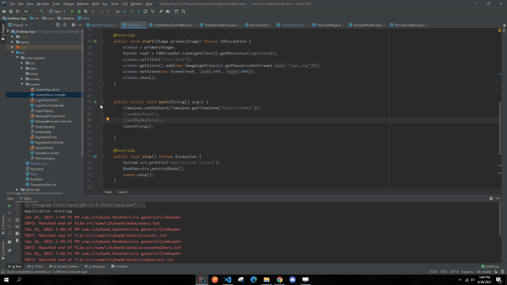
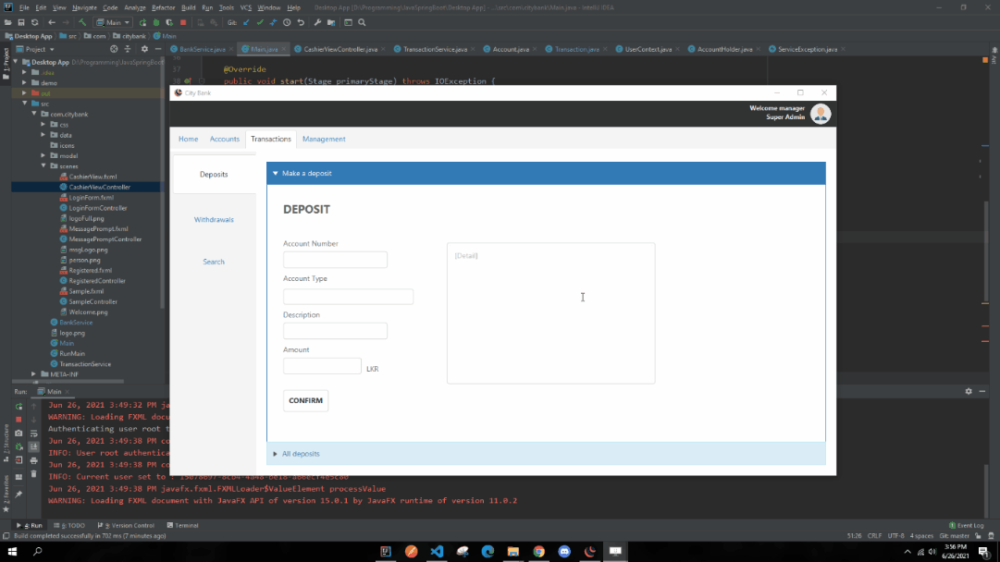

## **Project overview**

- This is a JavaFx project written using Fxml templates and controllers.
- It's about developing a desktop application for a bank, mainly focused towards cashiers and chashier manager.
- Text flies (.txt) are used for storing data as the main idea was to play with JavaFx.

---

### **Demo**

> Intro

---

 

### Running the project after cloning

> Project Settings

- Java version **11.0.4**
- Language level **9**
- Imported JavaFx as an external library.

*`NOTE` : For Net-Beans IDE above steps are enough to run the project*

If you are using **IntelliJ** as your IDE as I was you need to follow some extra steps. 

- Add VM options. Follow the given steps in [JetBrains Documetation](https://www.jetbrains.com/help/idea/javafx.html#vm-options).
---

 

### More demos

> Deposit

